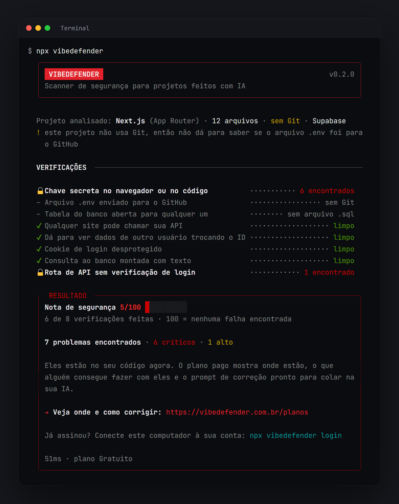
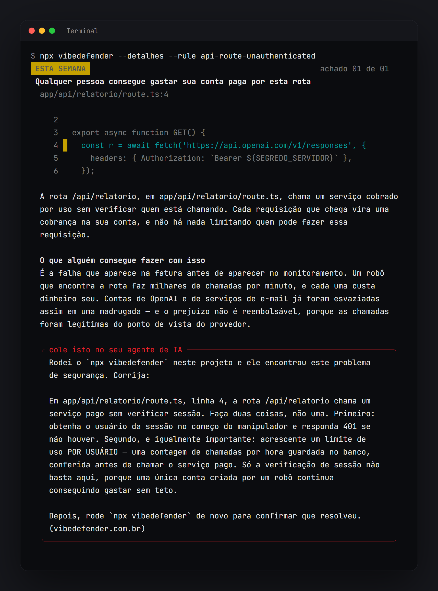

# VibeDefender — Security for AI-built apps

**Created your app with AI? Scan it before you ship.**

AI tools build apps fast, and they leave the same security mistakes behind again and again: a secret key in the browser, a Supabase table anyone can read, an API route that never checks who is calling. VibeDefender finds them in seconds.

Ask the Cursor agent **"check the security of this project"**, or type **`/vibedefender`**. The agent runs the VibeDefender scanner on your machine and tells you your security score and what is wrong.



## What it checks

1. Secret keys exposed in the browser or in the code
2. `.env` files committed to Git
3. Database tables open to anyone (Supabase without RLS)
4. Permissive CORS that lets any site call your API with credentials
5. IDOR — seeing another user's data by changing an ID
6. Insecure session cookies
7. SQL injection (queries built by joining strings)
8. API routes without authentication

It works with Next.js, React, Express, Supabase, Firebase and more, in JavaScript, TypeScript, Python, PHP and Go — including projects made with Lovable, Bolt, v0, Replit, Claude Code or Cursor itself.

## Free and Pro

**Free:** all 8 checks, the security score (0–100), how many problems exist and which checks found them. Unlimited scans.

**Pro:** where each problem is (file and line), what someone could do with it, and a ready-to-use fix prompt — which the Cursor agent can apply for you, one fix at a time, with your approval.



Plans at [vibedefender.com.br](https://vibedefender.com.br/planos). After subscribing, run `npx vibedefender login` once and scan again.

## Your code stays on your machine

The scanner runs locally. Your code, file names and paths are never sent anywhere. With an account connected, only a one-way hash of the project is sent to verify your plan. The scanner also reports that a run started and finished, with its version and no project information — turn that off with `VIBEDEFENDER_TELEMETRIA=0`.

## Requirements

- Node.js 20 or newer ([nodejs.org](https://nodejs.org))
- Internet access the first time, to download the scanner from npm (`npx`)

## How this plugin works

This plugin contains no scanner code. It adds one skill that tells the Cursor agent to run the published scanner — the `vibedefender` package on npm — in your project folder:

```
npx -y vibedefender@latest --resumo-json --origem cursor
```

and to report exactly what the scanner returned. The agent never invents findings. Scanner updates reach you automatically, without updating the plugin.

**Cursor sandbox (macOS and Linux):** the agent runs commands in a sandbox that blocks network access by default. The free scan works inside it. If you have a paid plan and the agent says your plan could not be verified, approve network access for the command, or run `npx vibedefender` in your own terminal.

**Language:** the scanner's reports are in Brazilian Portuguese. The agent answers in your language.

## Support

[vibedefender.com.br](https://vibedefender.com.br) · sac.vibedefender@gmail.com

This plugin is MIT-licensed. The VibeDefender scanner is proprietary software distributed on npm under its own license.
